|  Ziddan Makarim  |    312010063    |
|------------------|-----------------|
|  TI.20 A.1       | Pemrograman Web |

## Pertemuan 9 Lab7Web
Dalam pertemuan ini kita akan mempelajari PHP Dasar dengan beberapa program code PHP nya.

# PHP Dasar

## 1). Instal XAMPP
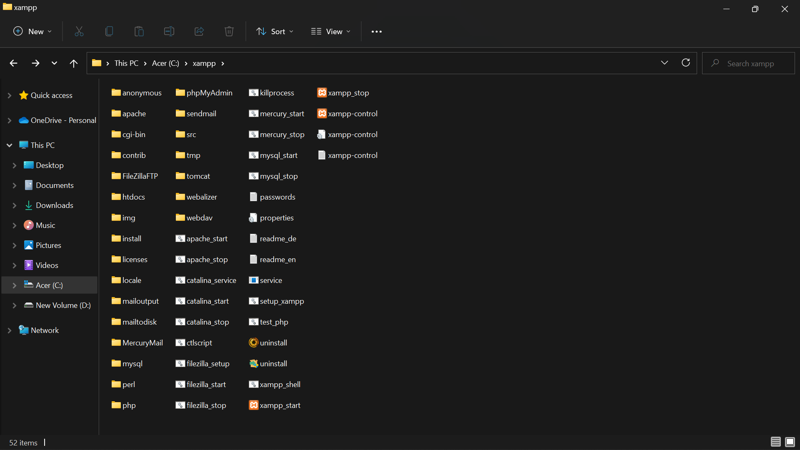
Install XAMPP kemudian ekstrak file dan sesuaikan lokasi penyimpanannya.

## 2). Menjalankan XAMPP
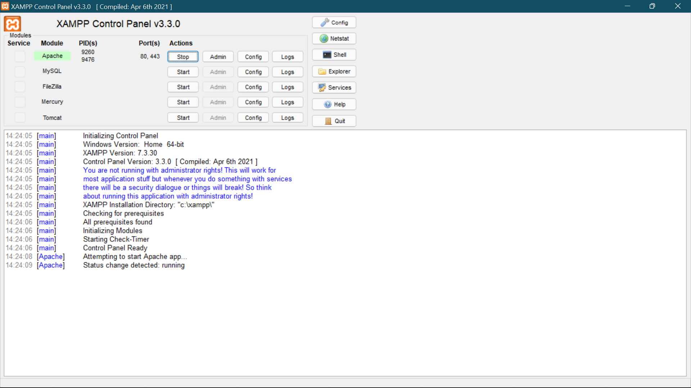
Menjalankan XAMPP dengan cara klik tombol Start pada server Apache seperti di gambar.

## 3). Memulai PHP 
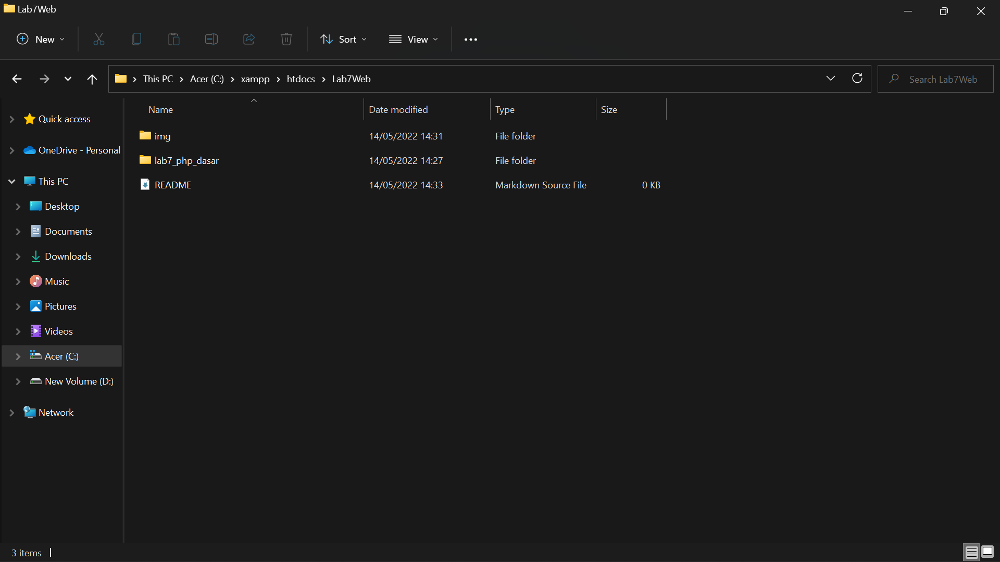
Buat folder lab7_php_dasar pada root directory web server (c:xampp/htdocs)

Kemudian akses directory pada web server dengan mengakses URL : http://localhost/Lab7Web/lab7_php_dasar/
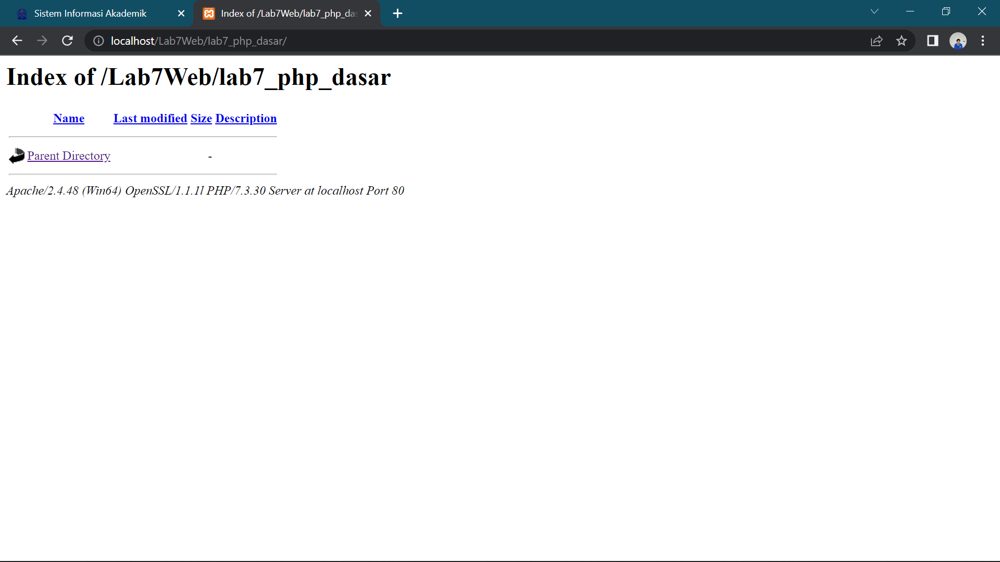

## 4). PHP Dasar
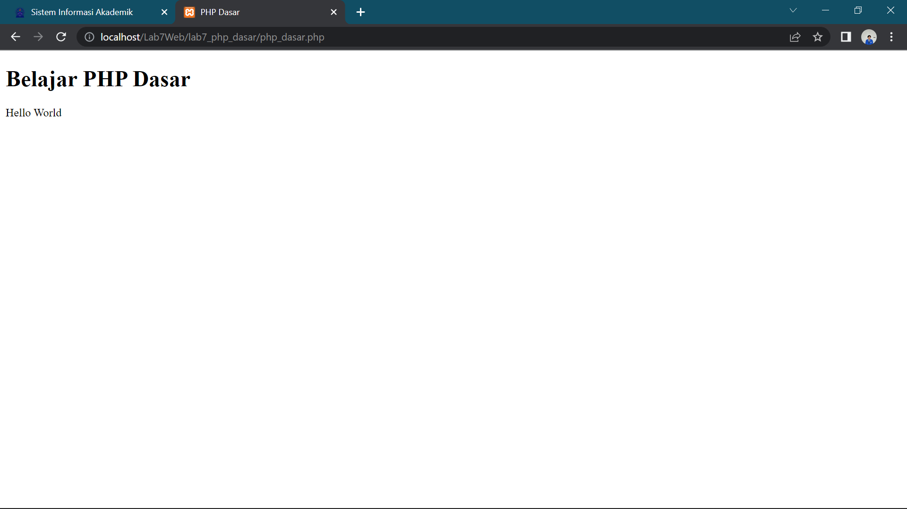 
Berikut hasil run PHP Dasar
### Contoh Coding
```php
<!DOCTYPE html>
<html lang="en">
<head>
    <meta charset="UTF-8">
    <meta http-equiv="X-UA-Compatible" content="IE=edge">
    <meta name="viewport" content="width=device-width, initial-scale=1.0">
    <title>PHP Dasar</title>
</head>
<body>
    <h1>Belajar PHP Dasar</h1>
    <?php
        echo "Hello World";
    ?>
```

## 5). Variabel PHP
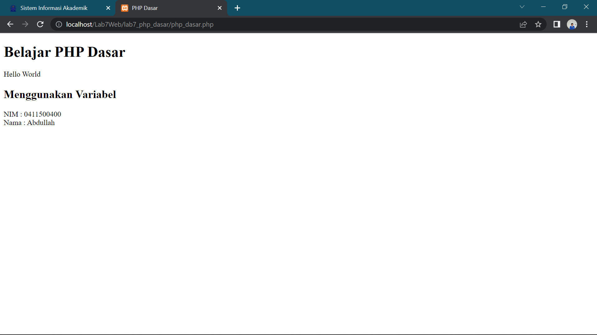
Berikut hasil run variabel pada program di PHP

### Contoh Coding
```php
 <!-- Variabel PHP -->
    <h2>Menggunakan Variabel</h2>
    <?php
        $nim = "0411500400";
        $nama = 'Abdullah';
        echo "NIM : " . $nim . "<br>";
        echo "Nama : $nama";
    ?>
```

## 6). Predefine $_GET
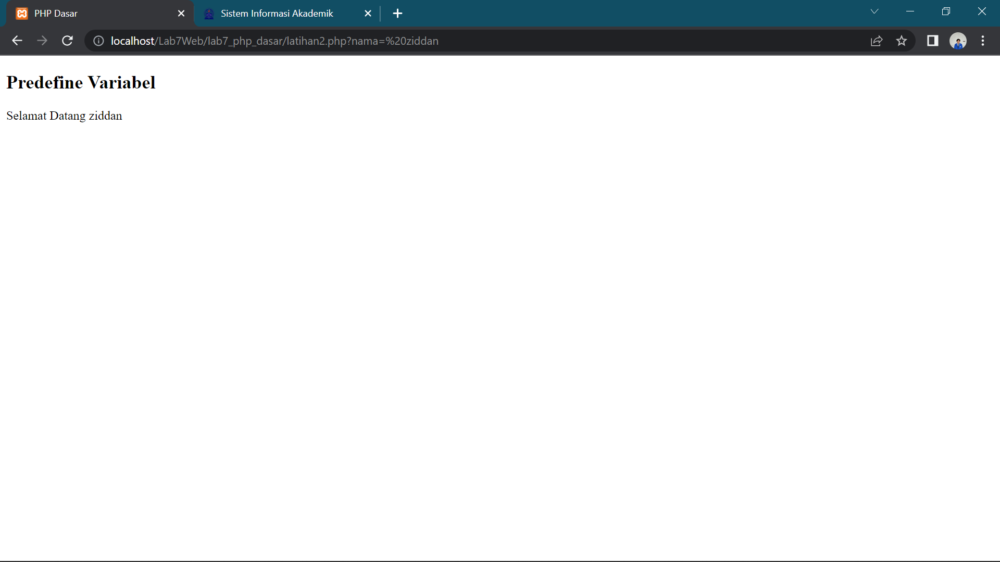
Buat file baru dalam directory lab7_php_dasar dengan nama filenya adalah latihan2.php dan untuk mengaksesnya menggunakan URL : http://localhost/Lab7Web/lab7_php_dasar/latihan2.php?nama=%20ziddan

### Contoh Coding
```php
<!DOCTYPE html>
<html lang="en">
<head>
    <meta charset="UTF-8">
    <meta http-equiv="X-UA-Compatible" content="IE=edge">
    <meta name="viewport" content="width=device-width, initial-scale=1.0">
    <title>PHP Dasar</title>
</head>
<body>
    <!-- Variabel $_GET -->
    <h2>Predefine Variabel</h2>
<?php
    echo 'Selamat Datang'. $_GET['nama'];
?>
</body>
</html>
```

## 7). Membuat Form Input
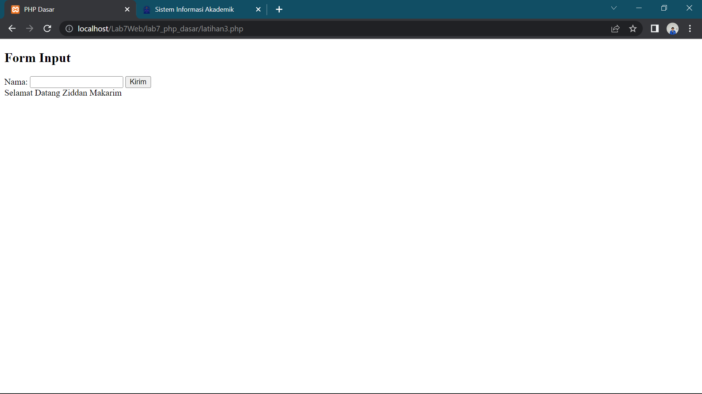
Buat File baru dengan nama latihan3.php dalam directory folder lab7_php_dasar 

Berikut adalah hasil atau tampilan dalam membuat form dalam php dengan variable $_POST 

### Contoh Coding
```php
<!DOCTYPE html>
<html lang="en">
<head>
    <meta charset="UTF-8">
    <title>PHP Dasar</title>
</head>
<body>
<h2>Form Input</h2>
<form method="post">
    <label>Nama: </label>
    <input type="text" name="nama">
    <input type="submit" value="Kirim">
</form>
<?php
    echo 'Selamat Datang ' . $_POST['nama'];
?>
</body>
</html>
```

## 8). Operator
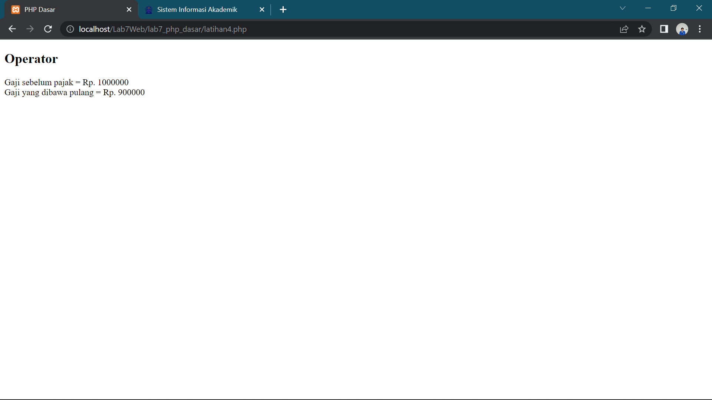
Membuat OPERATOR dalam php seperti contoh hasil tampilan di atas beserta code nya.

### Contoh Coding
```php
<!DOCTYPE html>
<html lang="en">
<head>
    <meta charset="UTF-8">
    <meta http-equiv="X-UA-Compatible" content="IE=edge">
    <meta name="viewport" content="width=device-width, initial-scale=1.0">
    <title>PHP Dasar</title>
</head>
<body>
<?php
    $gaji = 1000000;
    $pajak = 0.1;
    $thp = $gaji - ($gaji*$pajak);
        echo "Gaji sebelum pajak = Rp. $gaji <br>";
        echo "Gaji yang dibawa pulang = Rp. $thp";
?>
</body>
</html>
```

## 9). Kondisi IF
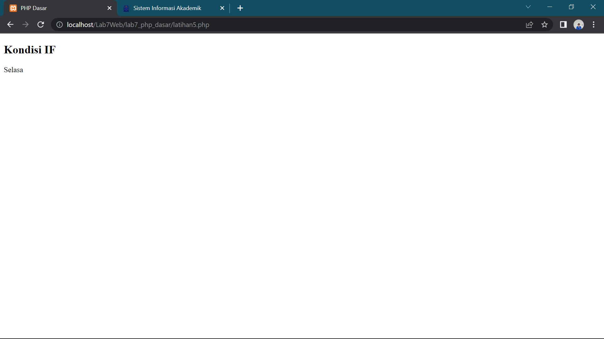
Pengondisian IF ELSE seperti hasil tampilan dan code digambar atas

### Contoh Coding
```php
<!DOCTYPE html>
<html lang="en">
<head>
    <meta charset="UTF-8">
    <meta http-equiv="X-UA-Compatible" content="IE=edge">
    <meta name="viewport" content="width=device-width, initial-scale=1.0">
    <title>PHP Dasar</title>
</head>
<body>
    <h2>Kondisi IF</h2>
<?php
    $nama_hari = date("l");
        if ($nama_hari == "Sunday") {
            echo "Minggu";
        } elseif ($nama_hari == "Monday") {
            echo "Senin";
        } else {
            echo "Selasa";
        }
?>
</body>
</html>
```

## 10). Kondisi Switch
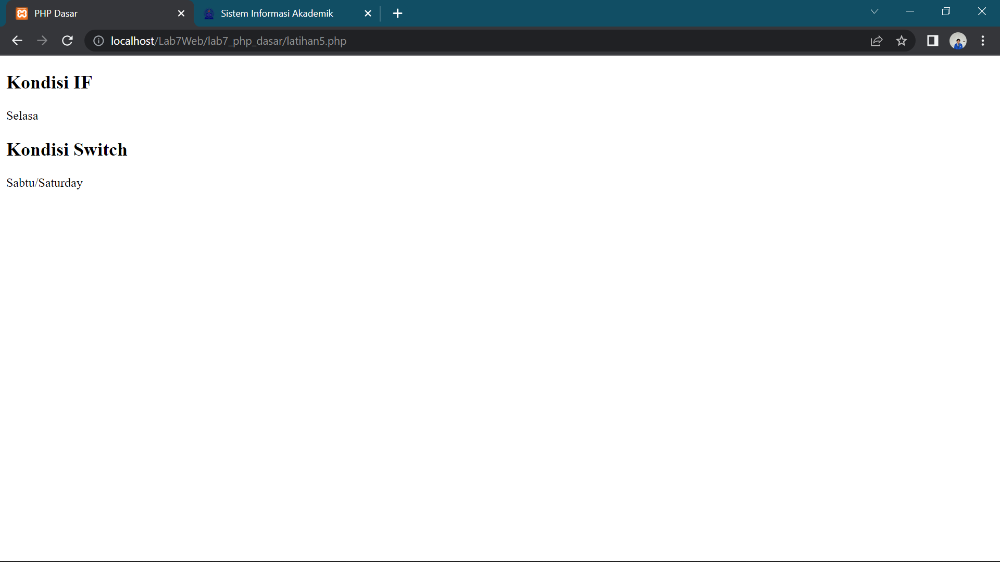
Contoh penggunaan pengondisian SWICTH CASE dengan Break seperti contoh hasil diatas beserta code.

### Contoh Coding
```php
 <h2>Kondisi Switch</h2>
<?php
    $nama_hari = date("l");
    switch ($nama_hari) {
        case "Sunday":
            echo "Minggu";
            break;
        case "Monday":
            echo "Senin";
            break;
        case "Tuesday":
            echo "Selasa";
            break;
        default:
            echo "Sabtu";
    }
    echo"/$nama_hari";
?>
```

## 11). Perulangan For
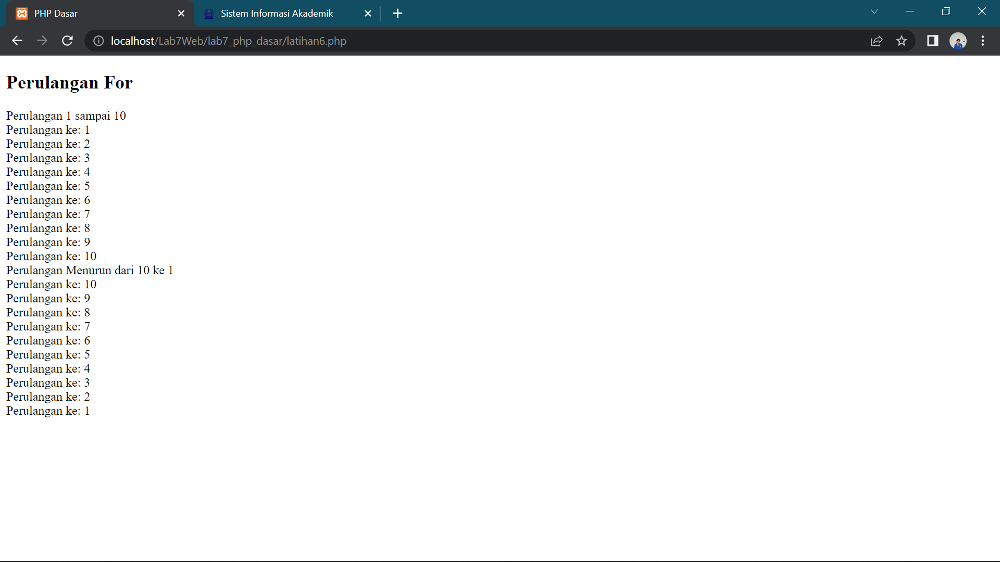
Menggunakan PERULANGAN FOR seperti hasil dan code di atas

### Contoh Coding
```php
<!DOCTYPE html>
<html lang="en">
<head>
    <meta charset="UTF-8">
    <meta http-equiv="X-UA-Compatible" content="IE=edge">
    <meta name="viewport" content="width=device-width, initial-scale=1.0">
    <title>PHP Dasar</title>
</head>
<body>
    <h2>Perulangan For</h2>
<?php
        echo "Perulangan 1 sampai 10 <br />";
    for ($i=1; $i<=10; $i++) {
        echo "Perulangan ke: " . $i . '<br />';
    }
        echo "Perulangan Menurun dari 10 ke 1 <br />";
    for ($i=10; $i>=1; $i--) {
        echo "Perulangan ke: " . $i . '<br />';
    }
?>
</body>
</html>
```

## 12). Perulangan While
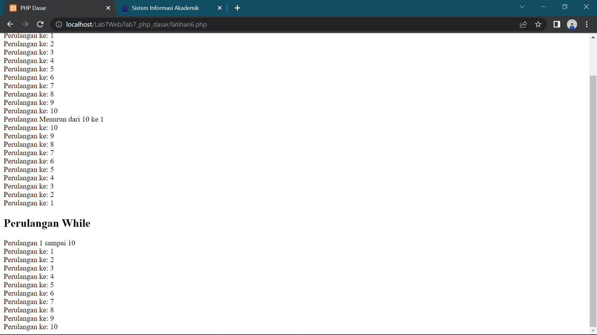
Menggunakan PERULANGAN WHILE seperti hasil gambar dan code di atas.

```php
 <h2>Perulangan While</h2>
<?php
        echo "Perulangan 1 sampai 10 <br />";
        $i=1;
    while ($i<=10) {
        echo "Perulangan ke: " . $i . '<br />';
        $i++;
    }
?>
```

## 13). Perulangan Dowhile
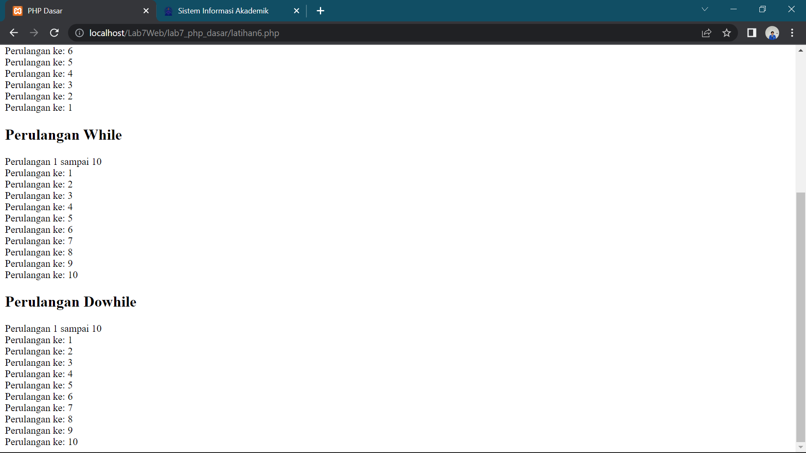
Menggunakan PERULANGAN DOWHILE seperti hasil gambar di atas yg beserta code php nya.

### Contoh Coding
```php
 <h2>Perulangan Dowhile</h2>
<?php
        echo "Perulangan 1 sampai 10 <br />";
        $i=1;
    do {
        echo "Perulangan ke: " . $i . '<br />';
        $i++;
        } while ($i<=10);
?>
```

